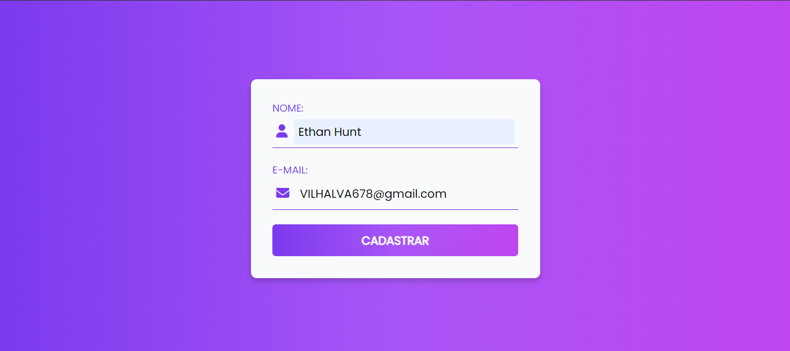
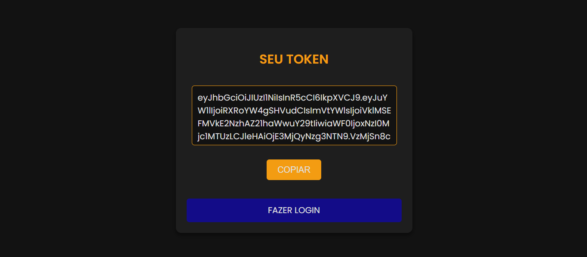
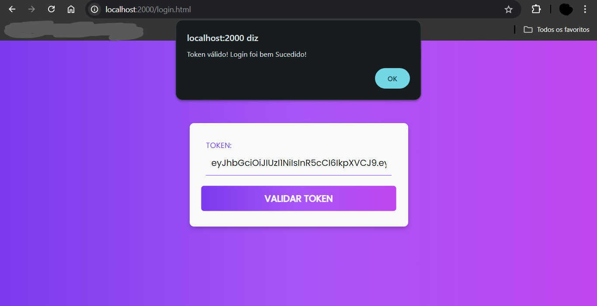
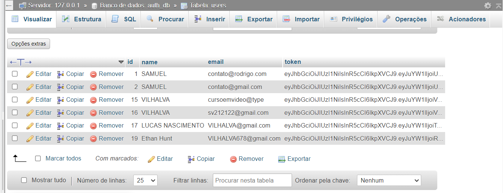

# LOGIN COM TOKEN
👨‍🏫FORMULARIO CADASTRO E LOGIN COM USO DE TOKEN.

 <br>
 <br>
 <br>
 <br>

## DESCRIÇÃO:
Este sistema é um exemplo de aplicação web usando Node.js, Express, e MySQL para o cadastro e login de usuários com autenticação baseada em tokens JWT (JSON Web Token). 

## FUNCIONALIDADES:
1. **Cadastro de Usuário:**
   - O usuário preenche um formulário com seu nome e e-mail.
   - Quando o formulário é enviado, o servidor gera um token JWT único para o usuário.
   - O token, junto com o nome e o e-mail do usuário, é salvo em um banco de dados MySQL.
   - O token gerado é retornado ao cliente como resposta.

2. **Verificação de Token:**
   - Em uma página separada, o usuário pode inserir o token que recebeu.
   - O servidor verifica a validade do token e retorna uma mensagem indicando se o token é válido ou não.

## COMO USAR?
1. **Importar o Banco de Dados:**
   - Importe o arquivo `./DATABASE/DATABASE.sql` para o seu banco de dados MySQL.

2. **Editar o `.env`:**
   - Edite o arquivo `./CODIGO/.env` com as seguintes configurações:

     ```plaintext
     DB_HOST=localhost
     DB_USER=seu_usuario
     DB_PASSWORD=sua_senha
     DB_DATABASE=auth_db
     JWT_SECRET=your_jwt_secret_key
     ```

    - Substitua `seu_usuario` e `sua_senha` pelas suas credenciais do MySQL.

3. **Instale as Dependências:**
   - Execute `npm install` no diretório `./CODIGO` para instalar as dependências do projeto:

     ```bash
     npm install
     ```
    
    - Este comando instala todas as dependências listadas no arquivo `package.json` do projeto.

4. **Inicie o Servidor:**
   - Ainda no diretório `./CODIGO`, execute o servidor Node.js com o comando:

     ```bash
     npm start
     ```

   - O servidor estará disponível em [http://localhost:2000](http://localhost:2000).

5. **Preencha o Formulário de Cadastro:**
   - **Nome:** Insira o nome do usuário.
   - **E-mail:** Insira o e-mail do usuário.

6. **Envie o Formulário:**
   - Clique no botão **"CADASTRAR"**.
   - O sistema enviará uma solicitação para o servidor, que gerará um token JWT, salvará as informações no banco de dados e retornará o token.

7. **Receba o Token:**
   - Após o cadastro bem-sucedido, você será redirecionado para a página que exibe o token.

8. **Visualize e Copie o Token:**
   - Na página de exibição do token, você verá o token gerado em um campo de texto.
   - Use o botão **"COPIAR"** para copiar o token para a área de transferência.

9. **Navegue para a Página de Login:**
   - Abaixo do token, há um botão chamado `FAZER LOGIN`, clique nele.

10. **Insira o Token:**
   - Cole o token copiado no campo de entrada disponível na página de login.

11. **Envie o Token para Verificação:**
   - Clique no botão **"VALIDAR TOKEN"**.
   - O sistema enviará o token para o servidor para verificação.

12. **Receba a Resposta do Servidor:**
   - Se o token for válido, uma mensagem de sucesso será exibida.
   - Se o token for inválido ou houver algum erro, uma mensagem de erro será exibida.

## NÃO SABE?
- Entendemos que para manipular arquivos em `HTML`, `CSS` e outras linguagens relacionadas, é necessário possuir conhecimento nessas áreas. Para auxiliar nesse aprendizado, oferecemos cursos gratuitos disponíveis:
* [CURSO DE HTML E CSS](https://github.com/VILHALVA/CURSO-DE-HTML-E-CSS)
* [CURSO DE JAVASCRIPT](https://github.com/VILHALVA/CURSO-DE-JAVASCRIPT)
* [CURSO DE NODEJS](https://github.com/VILHALVA/CURSO-DE-NODEJS)
* [CURSO DE EXPRESSJS](https://github.com/VILHALVA/CURSO-DE-EXPRESSJS)
* [CURSO DE MYSQL](https://github.com/VILHALVA/CURSO-DE-MYSQL)
* [CONFIRA MAIS CURSOS](https://github.com/VILHALVA?tab=repositories&q=+topic:CURSO)

## CREDITOS:
- [PROJETO CRIADO PELO VILHALVA](https://github.com/VILHALVA)
- [TRECHOS DO CSS FOI COPIADO DE "FORMULARIO DARK"](https://github.com/VILHALVA/FORMULARIO-DARK)


